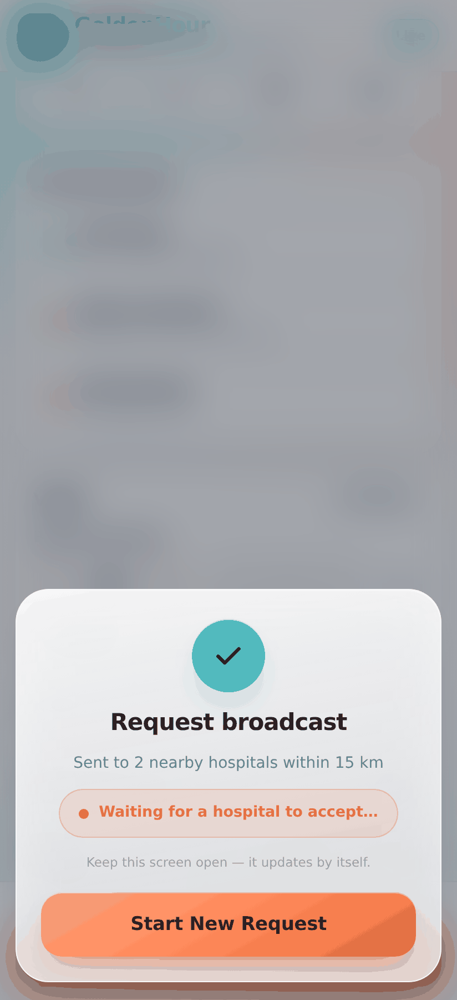
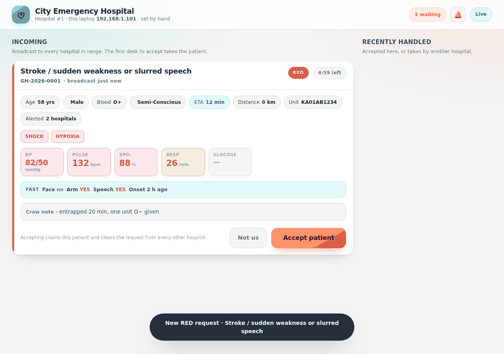
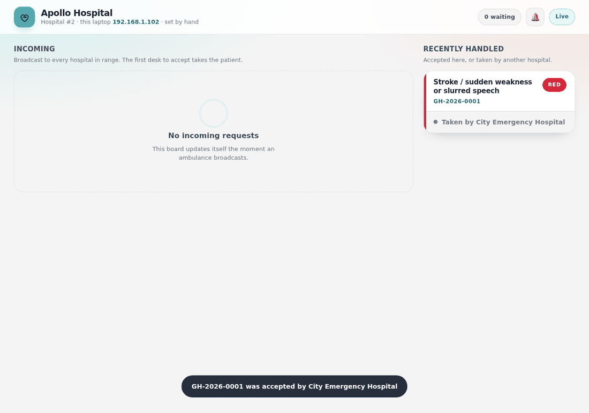

# GoldenHour — master repository

A paramedic fills a short form and presses **Broadcast Request**. Every hospital
in range is alerted at the same instant. The first ER desk to press **Accept**
claims the patient, and the request disappears from every other desk.

This repository is the ambulance app and the backend merged into one project,
with the hospital-side board added, so the whole system runs from a single
`npm start`.

```
goldenhour-master/
├── config/
│   └── hospitals.config.js     ★ the two hackathon laptop IPs — the only file you must edit
├── backend/
│   ├── src/                    Express + Socket.IO + MySQL (or in-memory) server
│   ├── public/hospital/        the ER desk board  → served at /hospital
│   ├── public/landing/         start-here page    → served at /
│   ├── database/schema.sql     MySQL schema + seed data
│   └── tests/                  end-to-end test of the two-laptop race
├── app/
│   ├── www/                    the ambulance app — source of truth
│   │   ├── config.js           ★ the server URL for the APK build
│   │   ├── index.html
│   │   ├── app.js
│   │   └── style.css           the Coral & Cyan design system
│   ├── android/                Capacitor project
│   └── tests/                  205 checks — payload, config, location, functional
├── docs/                       architecture, API contract, screenshots
├── QUICKSTART.md               ★ demo-day runbook (two laptops, ten minutes)
└── DEPLOYMENT.md               ★ local MySQL setup, and deploying for real
```

---

## What it looks like

| the ambulance broadcasts | both laptops light up | one accepts, the other clears |
|---|---|---|
|  |  |  |

More in [docs/screenshots](docs/screenshots/) — all captured from the running
system, not mock-ups.

---

## Quick start

```bash
npm run setup      # installs backend + app dependencies
npm run demo       # starts everything, in-memory store, no MySQL needed
```

The server prints the addresses to open:

```
Open on the HOSPITAL laptops :  http://192.168.1.100:5000/hospital
Open on the AMBULANCE device :  http://192.168.1.100:5000/ambulance
Landing page with all links  :  http://192.168.1.100:5000/
```

`npm start` does the same but uses MySQL when it can reach it (see
[With MySQL](#with-mysql)).

**The full demo-day runbook is in [QUICKSTART.md](QUICKSTART.md).**
**Setting up MySQL, or deploying to a real server: [DEPLOYMENT.md](DEPLOYMENT.md).**

---

## The two-laptop setup

For the internal hackathon, two laptops stand in for two hospitals. Each is
identified by its LAN IP address, hardcoded in `config/hospitals.config.js`:

```js
const HOSPITAL_LAPTOPS = [
  { hospital_id: 1, ip: '192.168.1.101', name: 'City Emergency Hospital', ... },
  { hospital_id: 2, ip: '192.168.1.102', name: 'Apollo Hospital',        ... }
];
const HACKATHON_MODE = true;   // every broadcast alerts BOTH laptops
```

Put the real IPs in, restart, and open `/hospital` on each laptop. Neither
laptop needs a login, a setting, or a URL parameter — the server recognises
them by where the request came from.

`HACKATHON_MODE = true` also makes every broadcast go to both laptops
regardless of GPS distance. The judging room is not fifteen kilometres from a
hospital, and a demo that quietly notifies nobody is worse than no demo. Set it
to `false` and hospitals come from the database, filtered by real Haversine
distance against the radius slider — which is exactly what the production
server will do.

**Escape hatch:** if the router hands a laptop a different IP, open
`/hospital?hospital=1` (or `2`) to set its identity by hand. The board says
which way it was decided, and warns you when it had to guess.

---

## What happens on Accept

The interesting part is that two laptops can press Accept in the same
millisecond, and exactly one must win.

With MySQL, the claim is one conditional statement:

```sql
UPDATE broadcasts
   SET status = 'ACCEPTED', accepted_hospital_id = ?, accepted_at = NOW()
 WHERE case_code = ? AND status = 'PENDING';
```

If `affectedRows` is 0, somebody else already won — the database decides,
not the application, and the whole thing sits inside a transaction that also
cancels the other hospitals' rows. The in-memory store gets the same guarantee
for free: Node runs one broadcast to completion before it starts the next.

The loser is not left guessing. It receives a `broadcast:claimed` event naming
the hospital that took the patient, and the card leaves its board with that
name on it.

---

## Running the tests

```bash
npm test
```

* `app` — 92 unit checks (payload rules, vital bands), 12 config checks (does
  the app know where its backend is, in a browser and inside the APK), 21
  location checks (what happens when GPS is refused), and 80 functional checks
  that boot the real `index.html` in jsdom and drive it like a paramedic would.
* `backend` — 40 end-to-end checks against the real server (a broadcast reaches
  both laptops, both accept simultaneously, exactly one wins, the loser gets a
  409 naming the winner, the ambulance's status flips, cancel and expiry work,
  junk coordinates are refused) plus 17 that flip `DESK_AUTH=jwt` and prove the
  production mode actually closes the door.

262 checks in total — 205 in the app, 57 against the running server.

---

## With MySQL

```bash
npm run setup
mysql -u root -p < backend/database/schema.sql
cd backend && cp .env.example .env      # then set DB_PASSWORD and DB_DRIVER=mysql
npm start
```

`DB_DRIVER` decides what happens when MySQL is not reachable:

| value | behaviour |
|---|---|
| `auto` (default) | try MySQL, fall back to the in-memory store with a loud warning |
| `mysql` | require MySQL, refuse to start without it — what you want in production |
| `memory` | skip MySQL entirely (same as `npm run demo`) |

The seeded logins are `admin@goldenhour.com`, `desk1@goldenhour.com`,
`desk2@goldenhour.com` and `crew@goldenhour.com`, all with the password
`admin123`. Delete them before this leaves a LAN.

Step-by-step, including a production server with HTTPS, systemd and the ER
desk behind real authentication: **[DEPLOYMENT.md](DEPLOYMENT.md)**.

---

## Building the APK

The APK is a separate build from everything else, and GitHub does it for you —
no Android Studio, no SDK, no Java install.

**Actions tab → "Build GoldenHour APK" → Run workflow.**

It asks for one thing: the backend address, e.g. `http://192.168.1.100:5000`
(the server prints it in its startup banner). The workflow writes that into
`app/www/config.js` before building, so you cannot ship an APK that points at
nothing. Leave it blank to use whatever is committed in the file.

About four minutes later, download the **goldenhour-apk** artifact from the run
page, unzip it, copy `app-debug.apk` to the phone, tap to install — allow
"Install unknown apps" once.

Two workflows, deliberately independent:

| workflow | when it runs | what it does |
|---|---|---|
| `.github/workflows/build-apk.yml` | manual, or a push touching `app/` | builds the APK. Does **not** wait for tests — a red test should never stop you getting an APK five minutes before a demo |
| `.github/workflows/tests.yml` | every push and PR | app suite and backend suite, as two parallel jobs |

Locally, if you have the Android SDK and JDK 21:

```bash
# set SERVER_BASE in app/www/config.js first
npm run apk        # → app/android/app/build/outputs/apk/debug/app-debug.apk
```

**Pick `debug`, not `release`.** A release build with no signing key produces
`app-release-unsigned.apk`, which a phone refuses to install. Debug installs
fine and is what a hackathon wants.

### If GPS is refused

Chrome only grants geolocation on secure origins, and `http://192.168.x.x` is
not one — so the app opened in a phone **browser** from the laptop's LAN
address gets GPS refused. The APK is unaffected (Capacitor's WebView is a
secure context and it uses the native GPS plugin), and so is a tunnelled HTTPS
address.

When any of that happens the app says why in plain language and offers a way
through rather than sitting on a form that will not send: the last fix from
this shift, a one-tap preset from `app/www/config.js`, or typed coordinates.
Whatever the crew picks travels to the ER as `origin.source`, and the board
labels the card **"Position set by hand"** so nobody reads an estimated
distance as a measured one.

Change the preset to wherever you are demoing:

```js
// app/www/config.js
FALLBACK_ORIGIN: { lat: 12.9716, lng: 77.5946, label: "Bengaluru city centre" }
```

### The one thing that goes wrong

Capacitor serves the APK's own files from `https://localhost`, so an APK with
no `SERVER_BASE` has nothing to auto-detect and drops into demo mode — the form
fills in, the broadcast goes nowhere, and the boards stay empty. The app now
says so on screen ("this build has no server address"), and
`app/tests/config.test.js` fails the build if that fallback ever breaks. Set
the address, or use the workflow input.

You do not need the APK at all to demo: `http://<server-ip>:5000/ambulance` in
the phone's browser runs exactly the same code, including GPS and the camera.

---

## API

The ambulance contract is unchanged from the original app — see
[docs/ambulance-app-api-contract.md](docs/ambulance-app-api-contract.md).
The app still never sends a priority and never names a hospital.

| endpoint | purpose |
|---|---|
| `GET /api/v1/case-types` | the case dropdown |
| `POST /api/v1/requests` | broadcast a case |
| `GET /api/v1/requests/:caseCode` | poll status |
| `POST /api/v1/requests/:caseCode/cancel` | crew stands down |
| `GET /api/v1/desk/me` | which hospital is this laptop |
| `GET /api/v1/desk/queue` | cases waiting for this desk |
| `POST /api/v1/desk/accept/:caseCode` | claim a case — first wins |
| `POST /api/v1/desk/decline/:caseCode` | pass on a case |
| `POST /api/v1/auth/*`, `/api/v1/cases/*`, `/api/v1/hospitals/*` | the original authenticated API, untouched |

Socket.IO events: `broadcast:new`, `broadcast:claimed`, `broadcast:declined`,
`broadcast:cancelled`, `broadcast:expired`, `broadcast:snapshot`,
`hospital:identity`, `case:status`.

Full detail in [docs/ARCHITECTURE.md](docs/ARCHITECTURE.md).

---

## After the hackathon

Nothing in the codebase has to be rewritten to go from two laptops to real
hospitals — the switches already exist:

1. `HACKATHON_MODE = false` in `config/hospitals.config.js`, and
   `ALLOW_MANUAL_HOSPITAL_OVERRIDE = false` with it. Radius matching goes live.
2. Insert the real hospitals — name, latitude, longitude, contact — into the
   `hospitals` table. Coordinates are what the Haversine match runs on.
3. `DESK_AUTH=jwt` in `backend/.env`. The ER desk stops trusting IP addresses
   and takes its identity from a signed token instead, so `?hospital=2` can no
   longer forge it. `backend/tests/desk-auth.test.js` (17 checks) covers it.
4. `CORS_ORIGIN`, a real `JWT_SECRET`, and delete the seeded `admin123`
   accounts.
5. Point `SERVER_BASE` at the hosted server and rebuild the APK.

The IP map is only the identity mechanism for the demo. Everything downstream
of it — the broadcast fan-out, the atomic claim, the realtime cancellation —
is the real design.

Full walkthrough with nginx, certbot, systemd and a verification checklist:
**[DEPLOYMENT.md](DEPLOYMENT.md)**.
